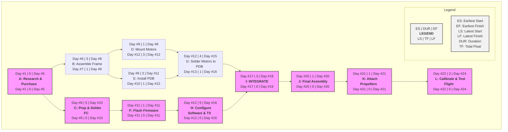

# test repo

test
-bullet

1. ghj


## MORE HEADING

```r
testinggg
```



```mermaid

%%{init: {'themeVariables': { 'fontSize': '20px' }}}%%

graph TD;
    subgraph " "

        %% Node Format:
        %% ES | DUR | EF
        %% Task Name
        %% LS | TF  | LF

        A["Day #1 | 5 | Day #5<br><b>&nbsp;&nbsp;A: Research & Purchase&nbsp;&nbsp;</b><br>Day #1 | 0 | Day #5"];
        B["Day #6 | 3 | Day #8<br>&nbsp;&nbsp;B: Assemble Frame&nbsp;&nbsp;<br>Day #7 | 1 | Day #9"];
        C["Day #6 | 5 | Day #10<br><b>&nbsp;&nbsp;C: Prep & Solder FC&nbsp;&nbsp;</b><br>Day #6 | 0 | Day #10"];
        D["Day #9 | 1 | Day #9<br>&nbsp;&nbsp;D: Mount Motors&nbsp;&nbsp;<br>Day #12 | 3 | Day #12"];
        E["Day #9 | 3 | Day #11<br>&nbsp;&nbsp;E: Install PDB&nbsp;&nbsp;<br>Day #10 | 1 | Day #12"];
        F["Day #11 | 1 | Day #11<br><b>&nbsp;&nbsp;F: Flash Firmware&nbsp;&nbsp;</b><br>Day #11 | 0 | Day #11"];
        G["Day #12 | 4 | Day #15<br>&nbsp;&nbsp;G: Solder Motors to PDB&nbsp;&nbsp;<br>Day #13 | 1 | Day #16"];
        H["Day #12 | 5 | Day #16<br><b>&nbsp;&nbsp;H: Configure Software & TX&nbsp;&nbsp;</b><br>Day #12 | 0 | Day #16"];
        I["Day #17 | 3 | Day #19<br><b>&nbsp;&nbsp;I: INTEGRATE&nbsp;&nbsp;</b><br>Day #17 | 0 | Day #19"];
        J["Day #20 | 1 | Day #20<br><b>&nbsp;&nbsp;J: Final Assembly&nbsp;&nbsp;</b><br>Day #20 | 0 | Day #20"];
        K["Day #21 | 1 | Day #21<br><b>&nbsp;&nbsp;K: Attach Propellers&nbsp;&nbsp;</b><br>Day #21 | 0 | Day #21"];
        L["Day #22 | 3 | Day #24<br><b>&nbsp;&nbsp;L: Calibrate & Test Flight&nbsp;&nbsp;</b><br>Day #22 | 0 | Day #24"];

        %% Define Dependencies (Arrows)
        A --> B;
        A --> C;
        B --> D;
        B --> E;
        D --> G;
        E --> G;
        C --> F;
        F --> H;
        G --> I;
        H --> I;
        I --> J;
        J --> K;
        K --> L;

    subgraph "Legend"
        Key["ES | DUR | EF<br><b>&nbsp;&nbsp;LEGEND&nbsp;&nbsp;</b><br>LS | TF | LF"]
        Key_Desc["ES: Earliest Start<br>EF: Earliest Finish<br>LS: Latest Start<br>LF: Latest Finish<br>DUR: Duration<br>TF: Total Float"]
    end

        %% Style the critical path nodes (Total Float = 0)
        style A fill:#f9f,stroke:#333,stroke-width:2px;
        style C fill:#f9f,stroke:#333,stroke-width:2px;
        style F fill:#f9f,stroke:#333,stroke-width:2px;
        style H fill:#f9f,stroke:#333,stroke-width:2px;
        style I fill:#f9f,stroke:#333,stroke-width:2px;
        style J fill:#f9f,stroke:#333,stroke-width:2px;
        style K fill:#f9f,stroke:#333,stroke-width:2px;
        style L fill:#f9f,stroke:#333,stroke-width:2px;
        %% Style the Legend
        style Key fill:#f2f2f2,stroke:#333,stroke-width:2px;
        style Key_Desc fill:#f2f2f2,stroke:#333,stroke-width:2px;
    end

```


